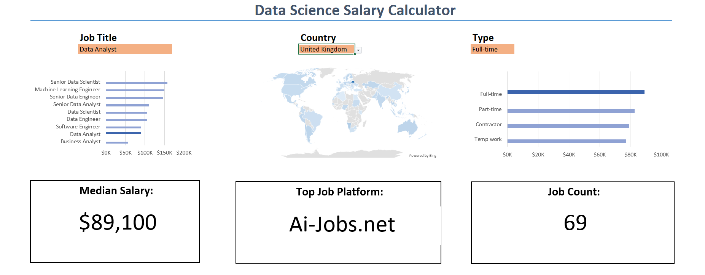

# Data Job Market Salary Calculator & Interactive Dashboard

## Project Overview
As an aspiring Data Analyst entering the competitive job market, I wanted to build a practical tool that answers three critical questions:
1. **What is the typical salary for a specific data role in a given country?**
2. **How many active job listings exist for these criteria?**
3. **Where are these companies actively hiring (which job boards/platforms)?**

This project is an **interactive, formula-driven Excel Dashboard & Calculator** designed to help job seekers estimate their market value, prepare for salary negotiations, and identify the best platforms to target during their job search.

---

## Interactive Features & Dashboard Preview



* **Dynamic Dropdowns:** Users can select a specific **Job Title** (e.g., Data Analyst, Data Scientist, Data Engineer) and **Country** (e.g., United States, United Kingdom, India).
* **Instant KPI Cards:** The dashboard instantly recalculates and displays the **Number of Jobs Available**, **Median Salary ($ USD)**, and the **Top Platform to Apply**.
* **Clean User Interface (UI):** Gridlines were removed, and structured card elements were styled using a clean corporate color palette to simulate a modern web application.

---

## Excel Skills Demonstrated
* **Dynamic Range Management:** `FILTER`, `UNIQUE`, and helper columns to construct clean, comma-free validation lists.
* **Advanced Formulas:** Multi-criteria `COUNTIFS`, custom nested array formulas (`MEDIAN` combined with `IF`), and `XLOOKUP`.
* **Data Validation:** Dropdown menus linked dynamically to automated background tables.
* **UI/UX Design:** Canvas formatting, gridline removal, strategic typography, and card-based layout structure.

---

## How the Calculator Engine Was Built 
Unlike standard dashboards that rely on Pivot Tables, this project is powered entirely by **dynamic background cell linking and logical formulas** divided across three distinct tabs: `Data` (raw data), `Analysis` (engine room), and `Calculator` (user interface).

### 1. Dynamic Dropdown Lists
To populate the dropdown menus without manual upkeep, I used the `UNIQUE` and `FILTER` functions on the **`Analysis`** tab to extract distinct Job Titles and Countries from the raw dataset. 

* **Data Cleaning Logic:** To ensure messy, comma-separated job profiles didn't clutter the dropdowns, I filtered out strings containing commas:
  ```excel
  =FILTER(UNIQUE(Data!Job_Title), ISERROR(SEARCH(",", UNIQUE(Data!Job_Title))))  

### 2. Live Job Counter (COUNTIFS)
To dynamically calculate the total volume of job postings matching the user's filtered criteria:  
  ```excel
  =COUNTIFS(Data!Job_Title, Calculator!C5, Data!Country, Calculator!C6)  
